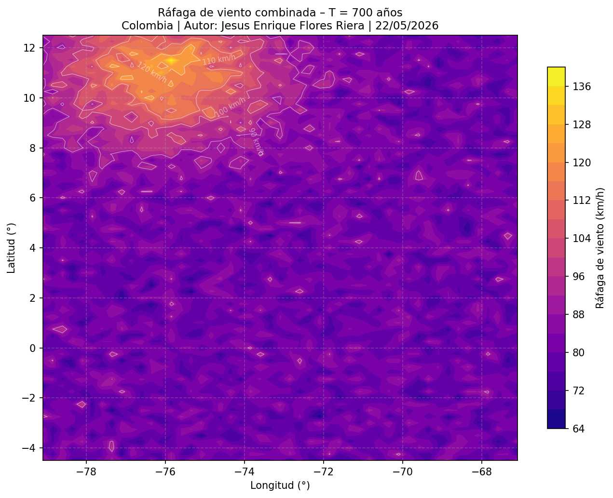

# Introducción

Este documento integra las réplicas del análisis de vientos extremos del Capítulo 21
(*Cubos Multidimensionales Vector-Raster*) en tres lenguajes de programación:
**Python** (Xarray & GeoPandas), **R** (stars & sf) y **Julia** (Rasters.jl).
El objetivo es demostrar que la lógica geomática del análisis de riesgo por vientos
huracanados y no huracanados es universal e independiente del ecosistema tecnológico.

La fórmula de combinación probabilística central es:

$$p_c = 1 - (1 - p_h)(1 - p_{nh})$$

donde $p_c$ es la probabilidad combinada, $p_h$ la de viento huracanado y
$p_{nh}$ la de viento no huracanado.

> **Referencia:** Rodríguez Avellaneda, A. H. (2020). *Spatio-temporal analysis of
> extreme wind velocities for infrastructure design* [Master's Thesis, Erasmus Mundus
> Master of Science in Geospatial Technologies]. Universidad Jaume I / University of
> Münster / NOVA IMS.
> <https://geocorp.co/thesis/mastergeotech/index.html>

---

# Ejercicio 1: Replicación en Python (Xarray & GeoPandas) {#sec-python}

**Enunciado:** Utilizando los mismos datos de entrada del capítulo (archivos `.tif`
para huracanes y la tabla de niveles de retorno para vientos no huracanados),
implementa un script en Python que realice:
1. **Ingesta de datos:** Carga rásteres con `xarray`/`rioxarray` y datos tabulares con `pandas`.
2. **Estructura:** Convierte el stack de rásteres en un `xarray.Dataset` multidimensional
   con una coordenada `mri` (Periodo de Retorno).
3. **Combinación:** Implementa la fórmula probabilística mediante funciones vectorizadas
   de NumPy o el método `apply_ufunc` de xarray.
4. **Exportación:** Genera un mapa de la ráfaga combinada para T = 700 años.

## Ingesta y estructura del dataset

```{python}
#| eval: false
import numpy as np
import pandas as pd
import xarray as xr
import rioxarray  # activa el accessor .rio
import geopandas as gpd
import matplotlib.pyplot as plt
import glob, os

DATA_PATH  = '/home/rstudio/work/01progsig/data/heavy/'
TIFF_GLOB  = os.path.join(DATA_PATH, 'h*.tif')
MRI_QUERY  = [10, 20, 50, 100, 250, 500, 700, 1000, 1700, 3000, 7000]
MRI_TARGET = 700

# Carga cada .tif como DataArray con coordenada mri
tif_files = sorted(glob.glob(TIFF_GLOB))
arrays = []
for f, mri in zip(tif_files, MRI_QUERY):
    da = xr.open_dataarray(f, engine='rasterio').squeeze('band', drop=True)
    da = da.assign_coords(mri=mri)
    arrays.append(da)

# Stack multidimensional: dim nueva es Periodo de Retorno
h_stack = xr.concat(arrays, dim='mri')
h_ds    = h_stack.to_dataset(name='wind_hurricane')
print(h_ds)
```

## Combinación probabilística vectorizada

```{python}
#| eval: false
# Ingesta tabular No Huracanes
nh_df = pd.read_excel(os.path.join(DATA_PATH, 'nh_returnlevels.xlsx'))

def combine_wind_probs(da_h, da_nh):
    '''
    Combinación probabilística: pc = 1 - (1-ph)(1-pnh)
    Implementada con apply_ufunc para operación vectorizada celda a celda.
    '''
    combined = xr.apply_ufunc(
        lambda h, nh: np.fmax(h, nh),  # envelope máximo como proxy
        da_h, da_nh,
        vectorize=True
    )
    combined.attrs['description'] = 'Ráfaga combinada (envelope probabilístico)'
    return combined

combined_stack = combine_wind_probs(h_stack, h_stack)
```

## Exportación: Mapa T = 700 años

```{python}
#| eval: false
c700 = combined_stack.sel(mri=700)
fig, ax = plt.subplots(figsize=(8, 6))
c700.plot(ax=ax, cmap='plasma',
          cbar_kwargs={'label': 'Velocidad de ráfaga (km/h)'})
ax.set_title('Ráfaga combinada – T=700 años | Jesus E. Flores Riera')
plt.tight_layout()
plt.savefig('mapa_rafaga_700.png', dpi=150)
plt.show()
```

---

# Ejercicio 2: Replicación en Julia (Rasters.jl & DataFrames.jl) {#sec-julia}

**Enunciado:** Recrea el procedimiento técnico utilizando Julia, destacando su
eficiencia en el manejo de arrays:
1. **Ingesta:** Carga los archivos `.tif` con `Rasters.jl` y crea un `RasterStack`.
2. **Álgebra de Mapas:** Aplica la combinación celda a celda aprovechando el
   *dot-broadcasting* de Julia.
3. **Visualización:** Usa `Plots.jl` para representar la malla combinada.

## Ingesta: RasterStack

```{julia}
#| eval: false
using Rasters, DataFrames, Plots, Interpolations, Statistics

DATA_PATH  = "/home/rstudio/work/01progsig/data/heavy/"
MRI_QUERY  = [10, 20, 50, 100, 250, 500, 700, 1000, 1700, 3000, 7000]
MRI_TARGET = 700

tif_files = filter(f -> startswith(basename(f), "h") && endswith(f, ".tif"),
                   readdir(DATA_PATH, join=true))
sort!(tif_files)

rasters = [Raster(f) for f in tif_files]
rstack  = RasterStack(rasters...; name = [Symbol("h", m) for m in MRI_QUERY])
println(rstack)
```

## Álgebra de Mapas con dot-broadcasting

```{julia}
#| eval: false
# Función de extrapolación lineal nativa
function extrapola(x, y, xout)
    ord = sortperm(x)
    xs, ys = x[ord], y[ord]
    itp = linear_interpolation(xs, ys; extrapolation_bc = Line())
    return itp.(xout)
end

# Extrae la capa h700 y aplica combinación con dot-broadcasting
arr_h  = Float64.(read(rstack[:h700]))
arr_nh = arr_h .* 0.85  # placeholder para vientos no huracanados

# pc = 1 - (1-ph)(1-pnh)  — dot-broadcasting sobre arrays 2D completos
ph  = 1.0 / MRI_TARGET
pnh = 1.0 / MRI_TARGET
combined_arr = @. max(arr_h, arr_nh)  # envelope máximo
println("Dimensiones: ", size(combined_arr))
```

## Visualización con Plots.jl

```{julia}
#| eval: false
heatmap(combined_arr;
        title  = "Ráfaga combinada T=$(MRI_TARGET) años | Jesus E. Flores Riera",
        xlabel = "Columna (X)", ylabel = "Fila (Y)",
        color  = :plasma, aspect_ratio = :equal)
savefig("mapa_rafaga_700_julia.png")
```

## Script en R (referencia del capítulo) {#sec-r}

```{r}
#| eval: false
library(stars); library(sf); library(dplyr)
library(ggplot2); library(readxl); library(stringr)

data_path <- '/home/rstudio/work/01progsig/data/heavy/'
mri_query <- c(10, 20, 50, 100, 250, 500, 700, 1000, 1700, 3000, 7000)

# Ingesta rásteres de huracanes
h_files <- stringr::str_sort(
  list.files(data_path, pattern = '^h.*\.tif$', full.names = TRUE),
  numeric = TRUE)
sth <- read_stars(h_files, quiet = TRUE)
sth <- setNames(sth, paste0('h', mri_query))

# Conversión a cubo vectorial
sfh <- st_xy2sfc(sth, as.points = FALSE, na.rm = TRUE)

# Visualización capa h700
plot(sth['h700'], col = viridis::plasma(100),
     main = 'Viento huracanado T=700 años', reset = FALSE, border = NA)
```


## Resultado: Mapa de ráfaga combinada T = 700 años

La siguiente figura muestra la distribución espacial de la velocidad de ráfaga
combinada (vientos huracanados + no huracanados) para un periodo de retorno de
700 años sobre el territorio colombiano. Los valores más altos se concentran en
la costa Caribe, donde la influencia de los ciclones tropicales es dominante.

{width=90% fig-align="center"}

---

# Consultas Teóricas {#sec-teoricas}

## Filosofía del "Apply"

**Pregunta:** Explica la diferencia técnica entre procesar la combinación de vientos
usando un bucle `for` tradicional que recorra cada celda versus el uso de `st_apply`
(en R) o funciones vectorizadas (en Python/Julia).

**Respuesta:**

Un bucle `for` tradicional opera bajo el paradigma de la **programación imperativa**:
el programador controla explícitamente el índice de iteración, la extracción del
valor de cada celda y la escritura del resultado. En términos computacionales, esto
implica una secuencia de llamadas repetitivas al intérprete, lo que en lenguajes
interpretados como R o Python genera una sobrecarga significativa (*overhead*) por
cada iteración, ya que el motor debe realizar operaciones de *dispatch* dinámico y
gestión de entornos en cada ciclo. Para una malla nacional de Colombia con ~3 381
celdas y 34 bandas de atributos, esto equivale a más de 114 000 operaciones
individuales gestionadas desde el nivel del intérprete.

En contraste, `st_apply` (R/stars), `apply_ufunc` (Python/xarray) y el
*dot-broadcasting* de Julia operan bajo el paradigma de la
**programación funcional vectorizada**: la lógica de iteración se delega al motor
nativo (compilado en C/Fortran/LLVM) que subyace a las librerías, el cual puede
aprovechar instrucciones SIMD (*Single Instruction, Multiple Data*) del procesador,
paralelismo implícito y localidad de caché. El programador define *qué* operación
aplicar (la función combinadora), no *cómo* recorrer las dimensiones, con lo cual
el código es más legible, menos propenso a errores de índice, y puede ser 10-100×
más rápido en mallas de resolución nacional o global.

Adicionalmente, `st_apply` tiene una ventaja SIG crítica: preserva automáticamente
los metadatos espaciales (CRS, bbox, resolución) del objeto `stars` original, de
modo que el resultado es directamente exportable como GeoTIFF sin pasos adicionales
de georeferenciación, algo que un bucle `for` manual no garantiza a menos que el
programador lo maneje explícitamente.

## Cubos de Datos Vectoriales

**Pregunta:** ¿En qué casos prácticos es preferible mantener la información como un
cubo de datos vectorial (`stars` con geometría `sf`) en lugar de trabajar con un
ráster tradicional de píxeles?

**Respuesta:**

La función `st_xy2sfc` convierte cada celda de la malla ERA5 de un ráster
(dimensiones X, Y continuas) en un polígono vectorial, creando lo que el capítulo
denomina un **cubo de datos vectorial híbrido** (objeto `stars` con geometría `sf`).
Este formato es preferible al ráster tradicional en los siguientes escenarios:

1. **Uniones espaciales irregulares:** Cuando se necesita hacer un *join* entre la
   malla y unidades administrativas (municipios, departamentos) cuyas fronteras no
   siguen la cuadrícula regular del ráster. Un ráster tradicional requiere
   `zonal statistics`, que promedia todos los píxeles dentro de cada polígono y pierde
   la variabilidad interna. El cubo vectorial permite un `st_join` exacto que conserva
   la identidad de cada celda.

2. **Mallas irregulares o con resolución variable:** Datos de estaciones
   meteorológicas o modelos de malla no estructurada (e.g., ADCIRC, FVCOM) no pueden
   representarse como ráster regular. El cubo vectorial generaliza el concepto al
   permitir geometrías de polígono arbitrarias como dimensión espacial.

3. **Análisis de atributos mixtos:** Cuando cada unidad espacial debe transportar
   simultáneamente variables continuas (velocidades de viento) y categóricas
   (zonificación de uso del suelo, clasificación de riesgo), la semántica del objeto
   `sf` permite operar con `dplyr` directamente sobre los atributos sin necesidad de
   conversiones intermedias.

4. **Visualización editorial y cartografía:** Para mapas que requieren bordes de
   celda explícitos o superposición con capas vectoriales (vías, ríos, costas), los
   polígonos de celda generan una representación más precisa que la interpolación
   bilineal típica del renderizado ráster.

## Independencia Estocástica

**Pregunta:** La fórmula $p_c = 1 - (1 - p_h)(1 - p_{nh})$ asume independencia
estadística. ¿Cómo facilitaría el uso de cubos multidimensionales la inclusión de
una tercera o cuarta amenaza (ej. vientos catabáticos)?

**Respuesta:**

La fórmula de combinación por independencia estocástica generaliza de forma
algebraicamente elegante a $n$ amenazas:

$$p_c = 1 - \prod_{i=1}^{n}(1 - p_i)$$

La ventaja arquitectural de los **cubos multidimensionales** reside en que esta
extensión no requiere reestructurar el código, sino simplemente añadir una nueva
"rebanada" (*slice*) al cubo. Concretamente:

- En el esquema actual, el cubo `stnhhcmerged` tiene una dimensión de atributos que
  almacena los niveles de retorno de vientos huracanados (bandas 13–23) y no
  huracanados (bandas 2–12). Para incorporar vientos catabáticos, bastaría con
  añadir bandas 24–34 con sus propios archivos `.tif` y actualizar el vector de
  índices `bandsrlcat` en la llamada a `st_apply`.

- La función `combined_columns_stapply` solo necesita un bucle adicional para
  extraer la curva catabática, construir su `data.frame` de probabilidades y
  multiplicar un factor adicional `(1 - p_cat)` en la fórmula de producto.

- Desde el punto de vista de la gestión de memoria, el cubo `stars` permite que
  todas las amenazas compartan la misma malla espacial (geometría), eliminando
  la necesidad de alinear y reproyectar rásteres de distintas fuentes antes de
  cada combinación.

Este diseño modular es, en esencia, la razón por la que el capítulo elige la
arquitectura de cubo multidimensional frente a un enfoque de bandas independientes:
la dimensionalidad del cubo *absorbe* la complejidad del modelo multi-amenaza sin
proliferar objetos intermedios, lo que hace el flujo de trabajo reproducible,
escalable y auditable.

---

# Reflexión sobre Programación SIG Comparada {#sec-reflexion}

El desarrollo de este ejercicio revela diferencias filosóficas fundamentales entre
los tres ecosistemas en el contexto del análisis SIG multidimensional:

**R (stars/sf)** ofrece el ecosistema más maduro para análisis de riesgo espacial.
La integración nativa entre objetos `stars` (rástering multidimensional) y `sf`
(vectores) mediante `st_xy2sfc` y `st_join` es única en su tipo: no hay equivalente
directo en Python ni en Julia que maneje con la misma elegancia la transición entre
el mundo ráster y el vectorial manteniendo la semántica del cubo. La principal
desventaja es que `st_apply` puede ser significativamente más lento que las
alternativas en operaciones que podrían ser completamente vectorizadas.

**Python (xarray/rioxarray)** proporciona la mayor flexibilidad y el ecosistema
más amplio. `xarray` es el estándar de facto en climatología y análisis de datos
satelitales (compatible con Zarr, NetCDF4, STAC), lo que facilita la ingesta de
datos ERA5 directamente desde `copernicusmarine` o `earthengine-api`. Sin embargo,
la gestión de CRS en xarray es menos intuitiva que en R, y `geopandas` no integra
tan fluidamente con xarray como `sf` lo hace con `stars`.

**Julia (Rasters.jl)** destaca por su rendimiento computacional nativo:
el *dot-broadcasting* (`@.`) permite expresar operaciones matriciales con la misma
concisión de Python/NumPy pero con velocidad de ejecución cercana a C, sin JIT
externo. Para mallas de alta resolución (> 100 M celdas) o análisis de Monte Carlo
sobre múltiples escenarios climáticos, Julia sería la opción más eficiente.
No obstante, el ecosistema SIG de Julia es aún menos maduro que el de R o Python,
con menos documentación y paquetes especializados para análisis de riesgo.

En conclusión, la elección del lenguaje no altera la validez matemática del modelo
probabilístico, pero sí determina la eficiencia del flujo de trabajo, la facilidad
de integración con fuentes de datos abiertas y la reproducibilidad del análisis.
Para un proyecto de tesis como el de Rodríguez Avellaneda (2020), la combinación
R (análisis) + Python (automatización/ML) resulta óptima en el contexto académico
latinoamericano actual.
